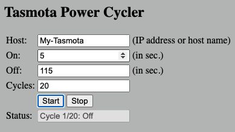
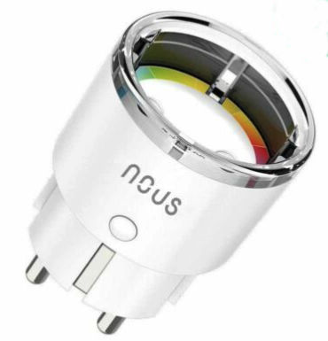

# Tasmota Power Cycler
### *Automatize periodical power cycling for a [Tasmota](https://tasmota.github.io/docs/)-Plug within a web browser*
\
&nbsp;
## Just one (my) use case:
To decalcify my Gaggia Classic espresso machine I have to turn the machine on and off periodically for around 45 minutes. It's quite time consuming and also boring to do this manually. With this simple HTML page you can specify the on- and off-duration as well as the amount of cycles to run. It just automatically sends the commands to my [Tasmota-Plug](https://templates.blakadder.com/nous_A1.html).

Tested with Tasmota v10.0
\
&nbsp;

